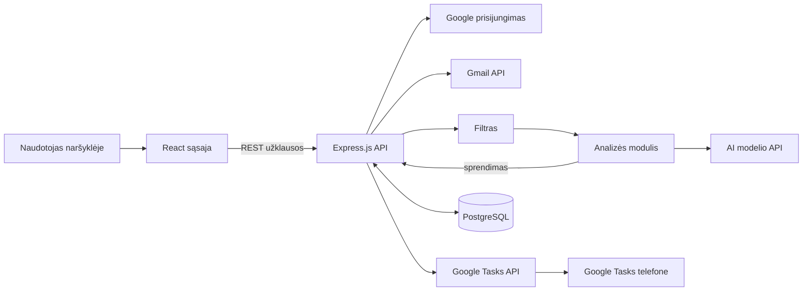

# PiEmail: svarbių laiškų atranka ir priminimai

Kursinio darbo I dalis: projektavimo dokumentas

## 1. Problema ir idėja

**Sistema vienu sakiniu:** PiEmail (Priority information email) yra internetinė programa verslininkams: ji peržiūri naujus Gmail laiškus, atrenka tuos, dėl kurių reikia ką nors padaryti, ir sukuria priminimus Google Tasks sąraše telefone.

**Problema ir dabartinis procesas:** Verslininkas dažnai turi kelias pašto dėžutes, pavyzdžiui, asmeninę ir verslo. Dabar svarbius laiškus jis pažymi žvaigždute arba palieka neskaitytus ir tikisi prie jų grįžti. Kai laiškų daug, kliento užklausa ar prieš kelis mėnesius sutartas užsakymas pasimeta tarp naujienlaiškių ir pranešimų. Žvaigždutė neturi termino ir pati neprimena apie save. Trūksta vienos vietos, kur matytųsi, ką reikia padaryti ir iki kada.

**Nauda:** Nebereikia kasdien naršyti visos dėžutės. Laiškai, kuriems reikia atsakymo, perskambinimo ar užsakymo įvykdymo, tampa užduotimis su data tame pačiame Google Tasks sąraše, kurį naudotojas jau turi telefone. Užsakymai su artėjančiu terminu gauna aukščiausią prioritetą.

**Naudotojai:** Verslininkas arba savarankiškai dirbantis žmogus. Jis prisijungia su savo Gmail paskyra, paspaudžia mygtuką laiškams patikrinti, peržiūri rezultatų sąrašą ir atlieka užduotis telefone.

**Prielaidos:** Žinau, kad per Gmail API galima skaityti laiškus, o per Google Tasks API kurti užduotis, kurios atsiranda telefono programėlėje. Prielaidos, kurias dar reikia patikrinti: dauguma nereikalingų laiškų atsijoja pagal Gmail kategorijas be AI; nedidelis AI modelis gerai supranta lietuviškus ir angliškus laiškus ir teisingai randa juose terminus.

## 2. Apimtis

Kursiniame darbe kuriama MVP versija su viena prijungta paskyra.

| Funkcija | Ką naudotojas galės atlikti | Pagrindinis modulis ar pagalbinė funkcija |
|---|---|---|
| Prisijungimas per Google | Prisijungia su viena Gmail paskyra ir leidžia programai skaityti laiškus bei kurti užduotis (kol kas prototipui bus leidžiama prisijungti su vienu gmail) | Pagalbinė |
| Laiškų tikrinimas ir filtras | Programa automatiškai paima naujus laiškus ir be AI atmeta šlamštą, reklamas ir naujienlaiškius | Pagalbinė |
| AI analizė ir prioritetas | Kiekvienam atrinktam laiškui nustatoma kategorija, reikalingas veiksmas, terminas ir prioritetas | Pagrindinis modulis |
| Užduotys Google Tasks | Svarbus laiškas tampa užduotimi su data ir nuoroda į laišką. Vienai laiškų gijai kuriama viena užduotis | Pagalbinė |
| Rezultatų sąrašas | Viename puslapyje mato išanalizuotus laiškus su kategorija, prioritetu, terminu ir būsena | Pagalbinė |

**Į kursinio darbo apimtį neįeina:** kelių paskyrų prijungimas; VIP ar blokuojamų siuntėjų nustatymai; automatinis laiškų tikrinimas pagal laiką (vėliau tą pačią funkciją būtų galima kviesti laikmačiu); prioriteto didėjimas laikui bėgant; rankinis AI rezultatų taisymas programoje; laiškų rašymas ar keitimas Gmail; Google Calendar; programos talpinimas internete. Programa veiks lokaliai, Google testavimo režimu.

## 3. Pagrindinis modulis

**Pavadinimas ir atsakomybė:** Laiškų analizės ir prioritetų modulis. Jis gauna filtrą praėjusį laišką, nusiunčia jį AI modeliui (pvz., gpt-4o-mini), patikrina atsakymą ir nusprendžia, ar kurti ar atnaujinti užduotį, kokio ji prioriteto ir kokia jos data.

**Logika, kurią reikės projektuoti ir testuoti:** AI tik supranta laiško turinį: priskiria kategoriją, suformuluoja veiksmą, randa terminą ir įvertina savo užtikrintumą. Visa kita daro taisyklės, kurias galima testuoti be AI: atsakymo tikrinimas, prioriteto balų skaičiavimas, užduoties datos skaičiavimas pagal darbo dienas ir sprendimas, ką daryti, kai toje pačioje laiškų gijoje ateina naujas laiškas. Kadangi prioritetą skaičiuoja taisyklės, tas pats AI atsakymas visada duoda tą patį rezultatą.

**Įvestis:** laiško duomenys ir išvalytas tekstas (be HTML, be ankstesnių laiškų istorijos, iki 4000 simbolių). Pavyzdys:

```json
{
  "messageId": "18c2f4a1",
  "threadId": "18c2e9b7",
  "from": "jonas@gmail.com",
  "receivedAt": "2026-10-05T09:14:00+03:00",
  "subject": "Stalviršių užsakymas",
  "body": "Laba diena, norėčiau užsakyti 3 ąžuolinius stalviršius. Ar galėtumėte pristatyti iki spalio 20 d.?"
}
```

**Išvestis:** AI rezultatas ir sprendimas dėl užduoties. Pavyzdys:

```json
{
  "category": "uzsakymas",
  "actionRequired": true,
  "actionText": "Patvirtinti 3 stalviršių užsakymą",
  "deadline": "2026-10-20",
  "confidence": 0.9,
  "score": 50,
  "priority": "aukstas",
  "taskDecision": "create",
  "taskDue": "2026-10-16"
}
```

Laukas `confidence` yra AI užtikrintumas nuo 0 iki 1.

**Veikimo eiga:**

1. Express.js API automatiškai su CRON darbu arba po mygtuko paspaudimo paima naujus laiškus iš Gmail ir praleidžia juos per filtrą.
2. Kiekvienas atrinktas laiškas perduodamas analizės moduliui.
3. Modulis siunčia laišką AI modeliui ir gauna nustatytos formos JSON atsakymą.
4. Modulis patikrina atsakymą ir apskaičiuoja prioritetą.
5. Modulis grąžina sprendimą: kurti užduotį, atnaujinti esamą arba nieko nedaryti.
6. Express.js API įvykdo sprendimą per Google Tasks API ir įrašo rezultatą į duomenų bazę.

### Taisyklės arba sprendimo žingsniai

1. Kategorija turi būti viena iš: užsakymas, kliento užklausa, perskambinimas, sąskaita, kita. Kitokia reikšmė reiškia netinkamą atsakymą.
2. Terminas yra data formatu `YYYY-MM-DD` arba tuščias. Neegzistuojanti data (pvz., `2026-02-30`) reiškia netinkamą atsakymą.
3. Jei AI atsakymas netinkamas arba AI paslauga grąžina klaidą, laiškas gauna būseną Nepavyko analizuoti ir užduotis nekuriama. Kito tikrinimo metu toks laiškas analizuojamas iš naujo.
4. Prioriteto balai lygūs kategorijos ir termino balų sumai. Kategorija: užsakymas 50, kliento užklausa 40, perskambinimas 40, sąskaita 30, kita 0. Terminas: jau praėjęs, šiandien arba rytoj +40, po 2-3 dienų +25, po 4-7 dienų +10, vėliau arba jo nėra 0.
5. Prioriteto lygis: 80 ir daugiau balų yra kritinis, 40-79 aukštas, mažiau nei 40 žemas.
6. Užduotis kuriama, kai laiškui reikia veiksmo, lygis aukštas arba kritinis ir užtikrintumas ne mažesnis nei 0,6. Jei užtikrintumas mažesnis, užduotis nekuriama, o sąraše laiškas pažymimas Reikia peržiūrėti.
7. Užduoties data: užsakymui 2 darbo dienos iki termino, kitoms kategorijoms pati termino diena, bet niekada ne anksčiau nei šiandien. Jei termino nėra, data yra kita darbo diena.
8. Viena laiškų gija turi tik vieną užduotį. Naujas laiškas toje pačioje gijoje atnaujina esamą užduotį (pavadinimą, datą, prioritetą) pagal naujausią terminą. Jei naujam gijos laiškui veiksmo nereikia, užduotis nekeičiama. Jei naudotojas užduotį telefone ištrynė, kuriama nauja.
9. Užduoties pavadinimas prasideda žyma [Kritinis] arba [Aukštas] 

### Scenarijai būsimiems testams

Visus scenarijus atliksiu pats: laiškus siųsiu iš savo asmeninės Gmail paskyros į programoje prijungtą paskyrą ir rezultatą tikrinsiu Google Tasks programėlėje bei programos sąraše. Datos nurodytos pavyzdžiui. Testuodamas kitą dieną, terminus laiškuose parinksiu taip, kad atstumas iki jų liktų toks pat.

| Scenarijus | Pradinės sąlygos ir konkreti įvestis | Veiksmas | Tikslus laukiamas rezultatas |
|---|---|---|---|
| Įprastas atvejis | Pirmadienis, 2026-10-05. Išsiunčiu naują laišką. Tema: Stalviršių užsakymas. Tekstas: Laba diena, norėčiau užsakyti 3 ąžuolinius stalviršius. Ar galėtumėte pristatyti iki spalio 20 d.? | Paspaudžiu Tikrinti laiškus | Kategorija užsakymas, 50 balų, lygis aukštas. Google Tasks atsiranda viena užduotis su žyma [Aukštas] ir data 2026-10-16 (2 darbo dienos iki antradienio 10-20) |
| Ribinis atvejis arba konfliktas | Trečiadienis, 2026-10-07. Gmail toje pačioje gijoje paspaudžiu Atsakyti ir parašau: Atsiprašau, stalviršių reikia jau rytoj, spalio 8 d. | Paspaudžiu Tikrinti laiškus | Terminas rytoj, todėl 50 + 40 = 90 balų, lygis kritinis. Nauja užduotis nekuriama: ta pati užduotis gauna žymą [Kritinis] ir datą 2026-10-07 (2 darbo dienos iki 10-08 būtų 10-06, bet data negali būti ankstesnė nei šiandien). Šiai gijai Google Tasks yra lygiai viena užduotis |
| Klaida arba neįmanomas rezultatas | `.env` faile nurodau neteisingą AI API raktą. Išsiunčiu naują laišką. Tema: Pasiūlymas. Tekstas: Laba diena, ar galėtumėte man paskambinti dėl jūsų pasiūlymo? | Paspaudžiu Tikrinti laiškus. Tada atkuriu teisingą raktą, perkraunu serverį ir paspaudžiu dar kartą | Po pirmo paspaudimo programa nenulūžta, laiškas sąraše turi būseną Nepavyko analizuoti, užduotis nesukurta. Po antro paspaudimo kategorija perskambinimas, 40 balų, lygis aukštas, sukurta viena užduotis su kitos darbo dienos data |

**Jei modulis naudoja AI:** AI gauna tik filtrą praėjusius laiškus: siuntėją, temą, datą ir išvalytą tekstą. Instrukcijoje nurodytos galimos kategorijos su keliais pavyzdžiais, šios dienos data ir tai, kad laiško tekstas yra tik duomenys, o ne komandos. Atsakymo formą tikrinu serveryje pagal schemą. Netinkamas atsakymas ar klaida tvarkomi pagal 3 taisyklę.

Kokybę vertinsiu su 20 laiškų iš savo pašto dėžutės, kuriuos pats sužymėsiu (kategorija, ar reikia veiksmo, terminas). Tikslas: kategorija teisinga bent 80 % laiškų, laiškai, kuriems reikia veiksmo, atpažįstami bent 90 % atvejų, terminas teisingas bent 90 % laiškų, kuriuose jis yra. Geriau sukurti nereikalingą užduotį nei praleisti svarbią.

## 4. Kokybės atributas

**Pasirinktas atributas:** Patikimumas: dirbant su tomis pačiomis laiškų gijomis ir tikrinant laiškus kelis kartus, nė vienas laiškas nepasimeta ir užduotys nesidubliuoja.

**Kodėl svarbus šiai sistemai:** Klientai dažnai atsako toje pačioje gijoje, patikslina terminą ar padėkoja. Jei kiekvienas toks atsakymas sukurtų naują užduotį, telefone susikauptų dublikatai ir naudotojas nustotų pasitikėti sąrašu. Jei laiškas dėl klaidos liktų neapdorotas, naudotojas apie jį nesužinotų.

**Tikrinimo scenarijus ir sąlygos:** Prijungtoje paskyroje yra įprasti naujienlaiškiai ir reklamos. Iš asmeninės paskyros išsiunčiu 3 laiškus, kurie pradeda 3 gijas:

- gija A: užsakymas su terminu po dviejų savaičių;
- gija B: prašymas perskambinti;
- gija C: kliento klausimas apie kainą.

Toliau atlieku šiuos žingsnius:

1. Paspaudžiu Tikrinti laiškus.
2. Iš karto paspaudžiu dar kartą, nors naujų laiškų nėra.
3. Perkraunu serverį ir paspaudžiu dar kartą.
4. Gijoje A atsakau, kad terminas paankstinamas iki rytdienos. Gijoje B atsakau: Ačiū, jau susiskambinome.
5. Paspaudžiu Tikrinti laiškus.

**Sėkmės kriterijus:** Po visų žingsnių Google Tasks yra lygiai 3 užduotys, po vieną kiekvienai gijai, dublikatų nėra. Gijos A užduotis turi žymą [Kritinis] ir šios dienos datą. Gijos B užduotis nepasikeitė. Programos sąraše yra visi 5 testiniai laiškai su galutine būsena. Duomenų bazėje kiekvienam testiniam laiškui yra lygiai vienas analizės įrašas, o naujienlaiškių analizės įrašų nėra.

**Numatytas projektavimo sprendimas:** Duomenų bazėje saugomi apdorotų laiškų Gmail ID su unikalumo apribojimu, todėl tas pats laiškas neanalizuojamas antrą kartą net po serverio perkrovimo. Atskiroje lentelėje kiekviena gija susiejama su Google Tasks užduoties ID. Gavęs naują laišką, modulis pirmiausia patikrina, ar gijai jau yra užduotis. Paskutinio tikrinimo laikas išsaugomas tik tada, kai visi laiškai įrašyti.

**Kaip patikrinsiu vėlesniame etape:** Atliksiu aprašytą scenarijų su savo Gmail paskyromis ir padarysiu ekrano nuotraukas iš Google Tasks bei programos sąrašo. Dublikatų ir analizės įrašų skaičių patikrinsiu paprasta SQL užklausa.

**Sprendimo kaina arba ribojimas:** Reikia papildomų lentelių ir patikrinimų prieš kiekvieną užduoties kūrimą. Jei naudotojas pats pakeičia užduotį telefone, naujas gijos laiškas jo pakeitimus perrašys.

## 5. Pradinė sistemos struktūra

### Paprasta schema



| Sistemos dalis | Atsakomybė |
|---|---|
| React sąsaja | Prisijungimo mygtukas, mygtukas Tikrinti laiškus, rezultatų sąrašas |
| Express.js API | Google prisijungimas, laiškų gavimas iš Gmail, filtro ir analizės modulio kvietimas, užduočių kūrimas Google Tasks, duomenų įrašymas |
| Filtras | Ima tik gautus laiškus ir atmeta šlamštą, Reklamų ir Socialinių tinklų kategorijas, laiškus su prenumeratos atsisakymo antrašte ir paties naudotojo išsiųstus laiškus |
| Analizės modulis | Pagrindinis modulis (3 skyrius) |
| PostgreSQL | Naudotojas ir jo prisijungimo raktai, apdoroti laiškai su būsenomis, gijų ir užduočių susiejimas |

**Planuojamos technologijos ir pasirinkimo priežastys:** Node.js su Express.js serveriui ir React sąsajai, nes abi dalys rašomos ta pačia kalba ir šias technologijas jau naudojau. Express.js ir React laikomi viename projekte (monolitas), kad būtų paprasta paleisti ir derinti lokaliai. PostgreSQL duomenims, nes reikia unikalumo apribojimų ir susietų lentelių. Google API kviesiu per oficialią googleapis biblioteką, AI modelį per jo tiekėjo biblioteką. Taisyklių testams naudosiu Vitest.

## 6. AI panaudojimas

### AI rengiant šį dokumentą

Taip, naudojau Claude (Anthropic).

| Priemonė ir užduotis | Ką panaudojau | Ką atmečiau arba perrašiau ir kodėl | Kaip patikrinau |
|---|---|---|---|
| Claude: pasirinkimas tarp Next.js ir Express.js monolito | Palyginimą, iš kurio nusprendžiau rinktis Express.js API su React sąsaja viename projekte | Atmečiau Next.js, nes norėjau aiškiai atskirto serverio, kurį lengviau suprasti ir testuoti | Įvertinau, kurias technologijas jau moku ir kas paprasčiau mano atveju |
| Claude: funkcionalumo apimtis ir Google API sąsajos | Supratimą, kaip veikia Google prisijungimas, laiškų gavimas, laiškų gijos ir užduočių kūrimas | Atsisakiau laiškų keitimo teisių, nes programa tik skaito | Palyginau su savo reikalavimais, išbandysiu kurdamas |
| Claude: dalinis šio dokumento pildymas | Pradinį tekstą, taisyklių ir scenarijų juodraštį | Pirmą versiją sumažinau iki MVP: išmečiau kelias paskyras, VIP nustatymus ir prioriteto didėjimą laikui bėgant. Testų scenarijus perrašiau taip, kad galėčiau juos atlikti su savo Gmail paskyromis | Ranka perskaičiavau scenarijų balus ir datas |

### Planuojamas AI naudojimas kuriant sistemą

**Kur ir kam naudosiu AI:** Pasikartojančiam kodui, testų juodraščiams, klaidų aiškinimui ir Google API pavyzdžiams. Pagrindinio modulio taisykles rašysiu pats.

**Kaip tikrinsiu pasiūlymus ir sugeneruotą kodą:** Perskaitysiu kiekvieną fragmentą, nenaudosiu kodo, kurio nesuprantu, ir paleisiu testus. Į AI nekelsiu tikrų slaptažodžių ar tikrų laiškų.

**Ar AI bus sistemos funkcionalumo dalis:** Taip. AI modelis klasifikuoja laiškus ir randa terminus. Prioritetą ir užduotis nustato taisyklės.

## 7. Tolesnių darbų planas

| Darbas | Apčiuopiamas rezultatas | Planuojama darbų seka |
|---|---|---|
| Google prisijungimas | Galiu prisijungti su savo Gmail paskyra, raktai išsaugomi duomenų bazėje | 1 |
| Laiškų gavimas ir filtras | Mygtukas Tikrinti laiškus parodo atrinktus laiškus, naujienlaiškiai atmesti | 2 |
| Analizės modulis | AI užklausa, atsakymo tikrinimas, prioriteto taisyklės ir jų testai | 3 |
| Google Tasks ir gijų susiejimas | Užduotys matomos telefone, vienai gijai viena užduotis | 4 |
| Rezultatų sąrašas | React puslapis su laiškais, prioritetais ir būsenomis | 5 |
| Testavimas su savo Gmail | Atlikti 3 skyriaus scenarijai ir 4 skyriaus patikimumo scenarijus, ekrano nuotraukos | 6 |
| Tolimesnis sistemos tikslinimas | Dėl funckionalumo su websockets/mechaniniu paspaudimu ir dėl prioritizavimo sistemos pagal rezultatus su savo Gmail | ų |

**Būsimo prototipo veikimo scenarijus:** Prisijungsiu su testine Gmail paskyra ir iš asmeninės paskyros nusiųsiu užsakymo laišką su terminu. Paspaudęs Tikrinti laiškus, sąraše pamatysiu laišką su kategorija ir prioritetu, o telefone Google Tasks programėlėje atsiras užduotis su teisinga data. Tada atsakysiu toje pačioje gijoje su nauju terminu ir parodysiu, kad pasikeitė ta pati užduotis, o naujos neatsirado.

| Rizika arba neaiškumas | Kaip patikrinsiu arba sumažinsiu |
|---|---|
| AI netiksliai supranta lietuviškus laiškus | Anksti išbandysiu su 20 laiškų. Jei rezultatai prasti, patobulinsiu instrukciją arba rinksiuosi kitą modelį |
| Google testavimo režime prisijungimas galioja tik 7 dienas | Programa paprašys prisijungti iš naujo |
| Google Tasks užduotis turi tik datą, be laiko | Skubiausios užduotys žymimos pavadinime |
| Filtras atmeta svarbų laišką | Patikrinsiu su tikra savo dėžute, kurie laiškai atmetami, ir prireikus sušvelninsiu filtrą |
| AI kaina | Analizuojami tik filtrą praėję laiškai, tekstas trumpinamas, pirmą kartą imami tik paskutinių 7 dienų laiškai |
| Laiškų privatumas | Prašomos tik skaitymo ir užduočių teisės, laiško tekstas duomenų bazėje nesaugomas |

